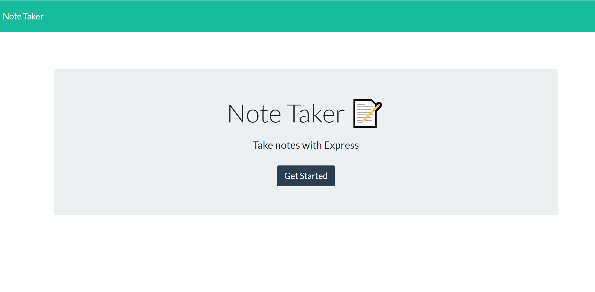
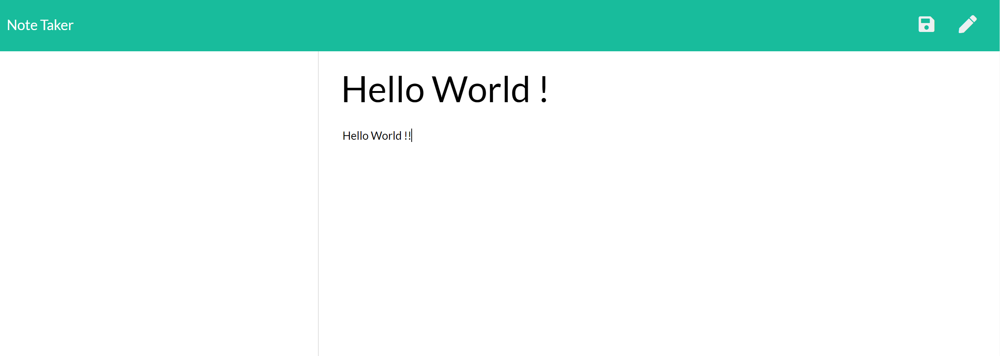
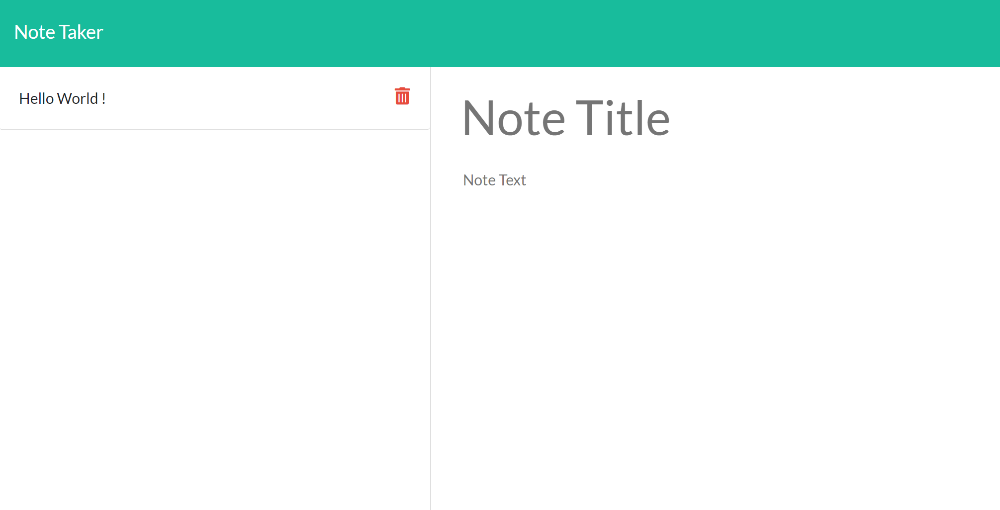

$$ NoteTaker

You can use this application for note taking. You will be able to write, save, and delete notes. 

$$ Link to Application

Follow [this link](https://midz-note-taker.herokuapp.com/) to view the application.

$$ Screenshots

$$ Desktop

$$ Deployment

You view the application on Local Host download the source code and run an NPM install. Then run node server.js to view the application on Local Host

$$ How to Guide

$ Click "Note Title" to add a title for the note you are entering. 
$ Click "Note Text" to add the text within your note.
$ Click the "Save" button to save the note. 
$ Click "delete icon" next to note title in the left panel to delete a note. 
$ Click the Note text to edit the the note.

$$ Language and Frameworks Used

$ HTML & CSS 
$ Javascript
$ Node.js
$ Express
$ JSON
$ ES6
